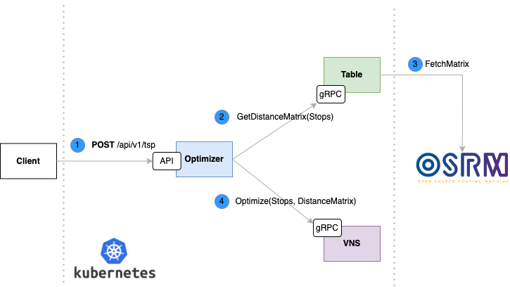

# TSP or Travelling Salesment Problem

The travelling salesman problem (also called the travelling salesperson problem or TSP) asks the following question: "Given a list of cities and the distances between each pair of cities, what is the shortest possible route that visits each city exactly once and returns to the origin city?" It is an NP-hard problem in combinatorial optimization, important in theoretical computer science and operations research.

## Solution

In order to solve TSP and find an Optimal Route we used a Neighbordhood Search Strategy.
We implemented a [Basic VNS algorithm](https://en.wikipedia.org/wiki/Variable_neighborhood_search) with [Local Serch](https://en.wikipedia.org/wiki/Local_search_(optimization)) to get a local optima solution. To leave the local optimal solution we implemented a swap skaker operator and to create new neighborhoods given an S' solution we implemented a [2-opt](https://en.wikipedia.org/wiki/2-opt) operator.

## Software Architecture

The Architecture is Based on Microservices in order to do Route Optimizations for a set of Stops. Each service solves one problem, Optimizer is the entry point to start an optimization and exposes an API REST to the client (POST /api/v1/tsp). The table is a gRPC Server to compute a Distance Matrix using [OSRM Project](https://project-osrm.org/) and VNS service exposes a gRPC service to perform a Metaheuristic algorithm it returns an Optimal Solution.

  

